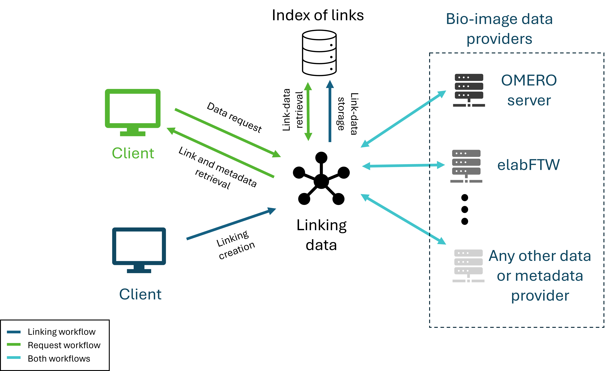
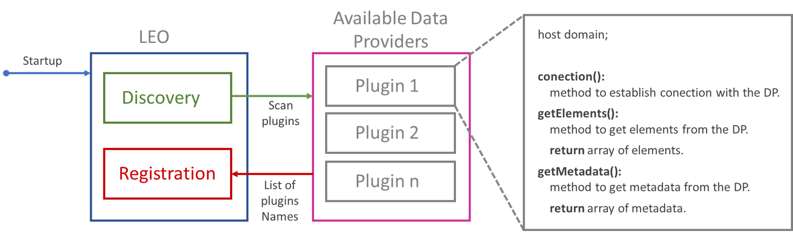
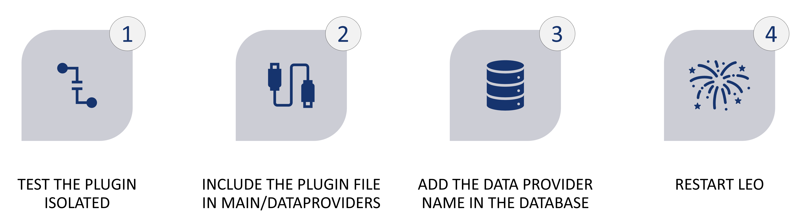
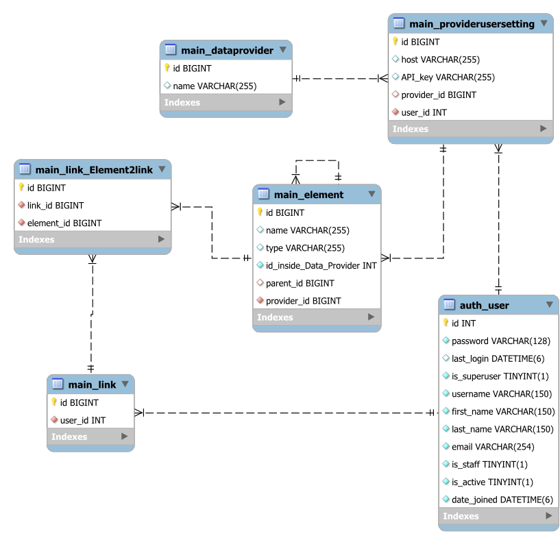

<p align="center">

</p>

<div align="center">

# LEO
#### Linking Electronic LabNotebooks with OMERO

</div>

## Brief overview

At the beginning , LEO was planned to integrate only electronic lab notebooks (ELNs) with the bioimage repository OMERO, now we have created a cloud-based system that allows the integration of more data providers using a plugin system. LEO operates through two main workflows (Fig. 1): firstly, users can define and establish links between data elements across different providers via a user-friendly interface, with these connections stored locally, i.e., an experiment recorded in an ELN can be directly linked to one or many images, projects or datasets in OMERO. Secondly, users can easily retrieve these established relationships and visualize all linked data, accompanied by a summary featuring essential metadata from each provider. LEO's backend was developed using Django, and vue.js as the frontend. This solution aims to streamline data management, enhance research reproducibility, and foster collaboration in the scientific community.

>Figure 1: Proposed architecture of LEO and workflows (request and linking creation).

## User manual
The user manual can be found at the following link : https://omelab-redg-448f84d12fc64c82920d8637d266da1a8cfb8475505579a70ce.pages.photonicdata.science/

## Admin manual

### Initialize with docker

Dependencies:
- Docker
- Docker-compose


Build the image
```
docker-compose build
```
Run the MySQL container
```
docker-compose up db
```
Run the server
```
docker-compose up -d
```

### Login system 

LEO interacts with OMERO to authenticate users. By default, the login page displays two server options: “repo.ipht-jena.de” and “127.0.0.1.” To ensure proper operation, you may need to modify or add additional OMERO servers. To do this, update the login.html file (specifically lines 46 and 47), located in the main/templates directory.

### Adding data providers

LEO employs a plugin system that allows the addition of more data providers. The life cycle of a plugin is illustrated in Fig. 2, showing that when LEO starts, it automatically searches for user-defined plugins and integrates them into the system for use.

>Figure 2: Plugin life cycle.

To implement a plugin in the system, follow these steps:

>Figure 3: Steps to include a new plugin.

1. Test the plugin in isolation.

   A template can be found below:
    ```                                                                                              from main.pluginSystem import dataProviderCore
    from main.pluginSystem.plugin_register import *
    class newDataProvider(dataProviderCore):
        def connection(self,request,host):
             #Apply any kind of process to establish connection to the host
    
        def getElements(self, request):
            connection = self.connection(request, self.host)
            #Apply any kind of process to get the elements to link
            return arrayOfElements = [{
                #mandatory
                "origin_id" : String with the ID inside the DP,
                "title": String with the name of the element,
                "types": String with the type of element (Experiment, Image, Database, etc.),
                "id": positive integer with a unique value in the request ,
                #optional
                "children": array of elements with the same characteristics of arrayOfElements,
                "parent": if a single element have the children variable, each element must contain a string with the id of its parent, 
                          if an element has no parent the element must be defined = "false",
                }, {second element},. . .]
    
        def getMetadata(self,request, array of elements):
            connection = self.connection(request, self.host)
            #Apply any kind of process to get the metadata of each element in the array
            return arrayOfMetadataInformation = [{
                #mandatory
                “Type" : String with the type of element (Experiment, Image, Database, etc.), 
                "Name": String with the name of the element,
                “ID": String with the ID inside the DP,
                #optional
                #Any other key is supported, which can be a normal string or an HTML formatted stringIf the second option is used, the key must end with "html“
                }, {second element},. . .]
            
    def initialize() -> None:
        register("newDataProviderName", newDataProvider)
   
    ```

2. Place it in the main/dataProviders folder.
3. Add the data provider name to the database.

    During startup, the server queries the database for all data provider names that need to be initialized. Once identified, the corresponding plugins for these providers are added to the system. Currently, two providers—OMERO and elabFTW—are automatically included via the initialData.json file. Their implementations can be found in the main/dataProviders folder.
    You can add a data provider name to the database by creating a superuser and navigating to “LEO-domain”/admin/main/dataprovider/, or by adding it directly in MySQL.

4. Restart LEO.

### DB ER


>Figure 4: ER of LEO.


